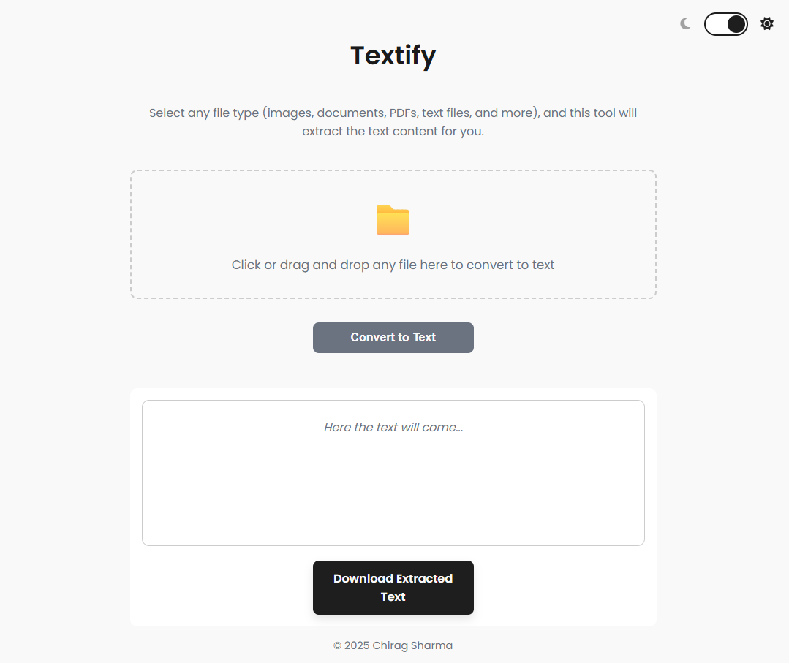
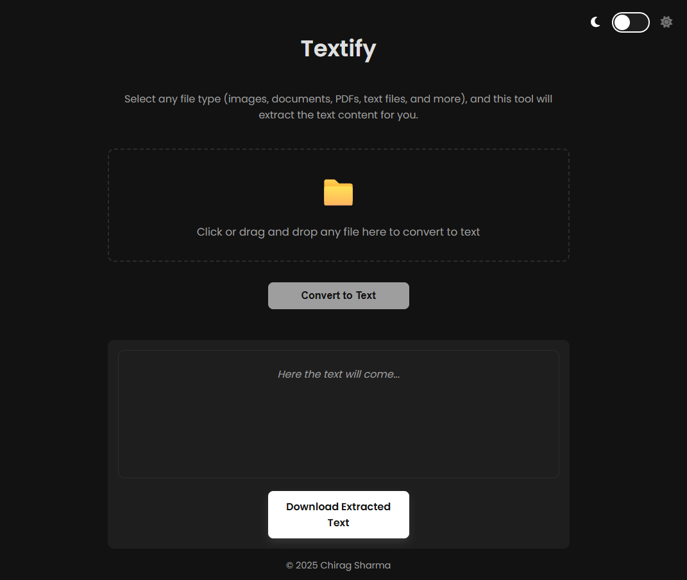
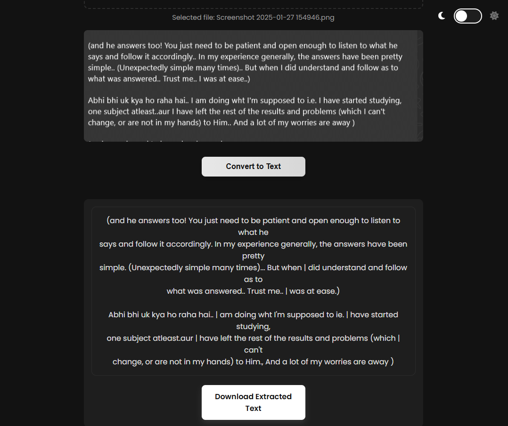

# 📝 Texitfy

Texitfy is a sleek and simple web app for extracting text from images using Optical Character Recognition (OCR). Powered by Python, Flask, and Tesseract OCR, it features a drag-and-drop UI, image preview, dark/light theme toggle, and download functionality.

## 🔗 Live Demo

Check out the live version of **Textify** here:  
👉 [https://textify-nx1d.onrender.com/](https://textify-nx1d.onrender.com/)


---

## 🚀 Features

- 🌓 Light/Dark mode toggle  
- 🖼️ Image preview before upload  
- 🧠 Fast OCR using Tesseract  
- 🖱️ Drag & drop or file input  
- 📥 Download extracted text  
- 📱 Mobile-friendly and keyboard accessible  

---

## 📦 Tech Stack

- **Frontend:** HTML, CSS, JavaScript  
- **Backend:** Flask (Python)  
- **OCR Engine:** Tesseract OCR  

---
### Screenshots

<p float="left">
  
  
  
</p>


## ⚙️ Installation

### 1. Clone the Repository

```bash
git clone https://github.com/yourusername/texitfy.git
cd texitfy
```

### 2. Create Virtual Environment & Install Dependencies

```bash
python -m venv venv
source venv/bin/activate  # For Windows: venv\Scripts\activate
pip install -r requirements.txt
```

### 3. Install Tesseract OCR

#### macOS

```bash
brew install tesseract
```

#### Ubuntu/Debian

```bash
sudo apt update
sudo apt install tesseract-ocr
```

#### Windows

- Download the installer: https://github.com/tesseract-ocr/tesseract  
- Add the Tesseract installation path (e.g. `C:\Program Files\Tesseract-OCR`) to your system's PATH environment variable.

---

## ▶️ Running the App

```bash
python app.py
```

Then open your browser and visit:  
[http://localhost:5000](http://localhost:5000)

---

## 🧪 Usage

1. Upload or drag-and-drop an image file  
2. Click **Extract Text**  
3. View, copy, or download the extracted text  

Supported file types: `.png`, `.jpg`, `.jpeg`, `.webp`, etc.

---

## 📁 Project Structure

```
texitfy/
├── app.py
├── requirements.txt
├── README.md
│
├── templates/
│   └── index.html
│
├── static/
│   ├── css/
│   │   └── styles.css
│   ├── js/
│   │   └── script.js
│   └── uploads/
```

---

## 🛠️ Customization Tips

- Change styling in `static/css/styles.css`
- Modify JS interactions in `static/js/script.js`
- Edit Flask logic in `app.py`
- Add more OCR languages or pre-processing techniques via Tesseract options

---

## 📃 License

This project is licensed under the **MIT License**.  
See the [LICENSE](LICENSE) file for more information.

---

## 🙌 Contributing

Pull requests are welcome!

To contribute:

1. Fork the repository  
2. Create a new branch: `git checkout -b feature/your-feature-name`  
3. Commit your changes: `git commit -m 'Add your feature'`  
4. Push to the branch: `git push origin feature/your-feature-name`  
5. Open a pull request

---

## 🙏 Acknowledgments

- [Tesseract OCR](https://github.com/tesseract-ocr/tesseract)  
- [Flask](https://flask.palletsprojects.com/)  
- [MDN Web Docs](https://developer.mozilla.org/)  

---

**Made with ❤️ for simplicity.**
